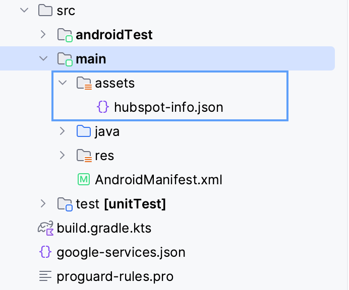

# Getting Started

The basic steps to get the SDK installed and opening chat views.

## Overview

The SDK containing hubspot chat view , notification functionality, and additional optional UI components.

### Installing & Configuring the SDK

As a start, you need to add a hubspot package into your applications. You can add these below line of code in the build.gradle file.
```
implementation "com.hubspot.mobilechatsdk:mobile-chat-sdk-android::LATEST_VERSION"  // Use the latest version of the sdk here
```

Be sure to download and include the `hubspot-info.json` file from your hubspot account and keep it
inside the assets folder in the app.

The folder structure looks like : app -> src -> main -> assets -> hubspot-info.json

The SDK needs to be configured once per app launch, before use. The most convenient place to do this is during the app initialization.
As a first step, you should create a instance of the HubspotManager class and then use the configure method.

```kotlin
val manager = HubspotManager.getInstance(context)
manager.configure()
```

`HubspotManager.getInstance(context)`:  It needs a context to make a object of HubspotManager
`manager.configure()`: It uses for configure the app with Hubspot SDK

#### Initialisation Errors

Failure to include the config file, or forgetting to include the file as being part of your apps target will cause initialisation to throw an errors.
`HubspotConfigError` class represents different errors when missing properties.

### Opening Hubspot Chat View

The chat view can be presented by HubspotWebActivity which extends Activity class. We can open it by
directly calling startactivity via intent, we can create any kind of button and on click of that button, we can
open the HubspotWebActivity or we can simply add HubspotFloatingActionButton in the file which handle the clicks and open the HubspotWebActivity automatically.
For an example:

```kotlin
binding.anybutton.setOnClickListener {
    startActivity(Intent(requireContext(), HubspotWebActivity::class.java))
}
```

### Identifying Users with the Hubspot Visitor Identification Token

To optionally identify users, you must first obtain a visitor token using the visitor identification
api, detailed
at [https://developers.hubspot.com/docs/api/conversation/visitor-identification](https://developers.hubspot.com/docs/api/conversation/visitor-identification)

This API is best implemented in your own server project, and the identity token passed to your app
by whatever method works for your specific setup - perhaps in response to your own user login or
session management, or as a result of a dedicated api.

Once a token is generated, it can be set using your email and token. You can use this method `HubspotManager.setUserIdentity(email, identityToken)`. 
This should be called before opening a chat view.

### Adding Custom Chat Data Properties

The SDK supports including key value pairs of data when opening a chat session. You can add your own
values to these, as well as declare some common permission data if you wish, if that is something
that would be useful for agents during a chat session.

See `HubspotManager.setChatProperties(keyValuePair: Map<String, String>)` for the method to use.
This is best called before starting a chat, and applies to all new chats.
You could set an account status, or some other identifiers when setting up your user, and these will
appear in all chats opened for the remainder of the app launch.

An example of setting a mix of pre-defined properties, and custom properties.

```kotlin
 val keyValuePair = mapOf(
    ChatPropertyKey.CameraPermissions.chatPropertyValue to "false",
    ChatPropertyKey.PhotoPermissions.chatPropertyValue to "false",
    ChatPropertyKey.NotificationPermissions.chatPropertyValue to "false",
    ChatPropertyKey.LocationPermissions.chatPropertyValue to "false"
)

hubspotManager.setChatProperties(keyValuePair)
```

### Clearing Data On Logout

The SDK stores in memory identification tokens, email address, and any properties set. The push
token for the app is also associated with the current user , if applicable.
There are situations where you know you might want to clear this data, such as during a logout or
changing user in a multi user app.
To clear this data, call `HubspotManager.logout()` at an appropriate time in in your app. 
**Note:** This only impacts the data used for future chat sessions - it has no impact on data or chat sessions
already stored in hubspot.

### Edge-to-Edge Display Behavior

**Versions 1.0.4 and Lower:**

These versions do not inherently handle edge-to-edge display. To temporarily opt out of edge-to-edge behavior while using these versions
add the following style item to your `application` or `activity` theme in your `styles.xml` or `themes.xml` file:

```
<item name="android:windowOptOutEdgeToEdgeEnforcement">true</item>
```

**Future SDK Releases:**

Newer releases of this SDK are designed to support Android's edge-to-edge display capabilities.
When edge-to-edge is enabled in your application, your content will draw behind the system bars (Status Bar and Navigation Bar).

To achieve a seamless edge-to-edge experience, you typically configure your application's theme and set the desired background for your window.

To set the background color that will be visible behind the system bars when they are transparent or translucent, define a color for the `android:windowBackground`
attribute in your application or activity theme within your `themes.xml` or `styles.xml` file. Then, apply this theme to your `application` or the relevant `activity` in your `AndroidManifest.xml`.

Example:

To set the window background color for a specific activity (e.g., HubspotWebActivity), define a theme like this in your `themes.xml` or `styles.xml`:
```
<!-- Theme defining the window background color for HubspotWebActivity -->
<style name="Theme.HubspotChat" parent="Base.Theme.DemoApp">
    <!-- Sets the background color of the activity's window -->
    <item name="android:windowBackground">@color/orange</item>
</style>
```
Then, apply this theme to the activity in your `AndroidManifest.xml`:

```
<activity
    android:name="com.hubspot.mobilesdk.HubspotWebActivity"
    android:theme="@style/Theme.HubspotChat"
    ... />
```
